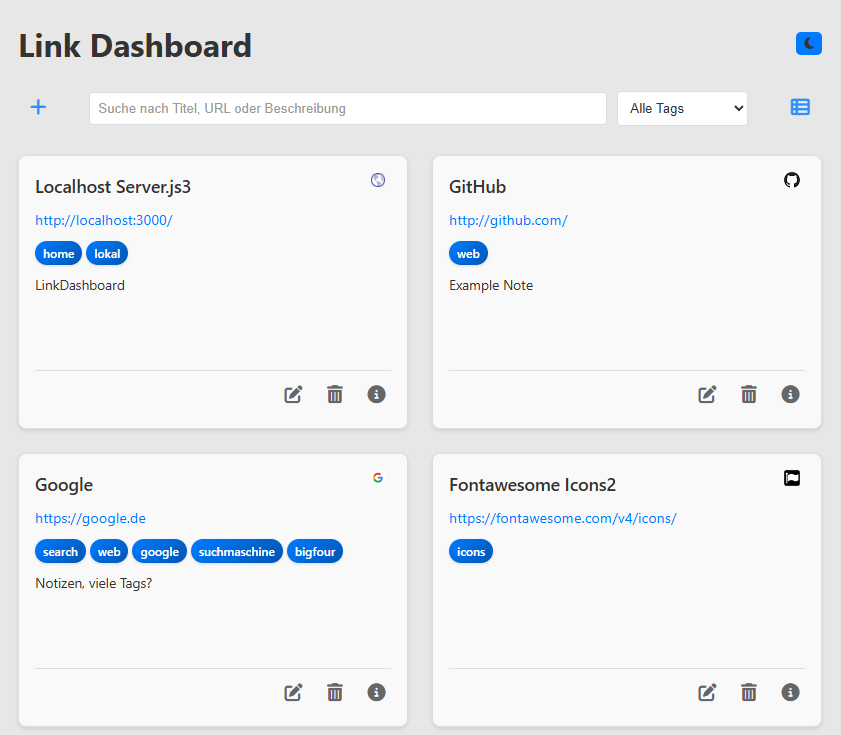

# Linkboard - Web-based Link Management System

A modern dashboard for managing and organizing web links with advanced features for categorization, search, and user interaction.



## Architecture

### Backend
- **Runtime**: Node.js with Express.js Framework
- **Database**: SQLite with automatic schema initialization
- **API**: RESTful endpoints with CORS support
- **Validation**: Server-side input validation and sanitization
- **Error Handling**: Structured exception handling with HTTP status codes

### Frontend
- **Technology**: Vanilla JavaScript (ES6+)
- **Styling**: Modular CSS with CSS Custom Properties
- **Responsive Design**: Mobile-first approach with Flexbox/Grid
- **State Management**: LocalStorage for user preferences
- **API Communication**: Fetch API with Promise-based error handling

## Installation and Deployment

### System Requirements
- Node.js >= 14.0.0
- npm >= 6.0.0

### Setup
```bash
# Clone repository
git clone <repository-url>
cd linkboard

# Install dependencies
npm install

# Start development server
npm start
```

The application will be available at `http://localhost:3000`.

### Production Deployment
```bash
# For production environment
NODE_ENV=production npm start
```

## Feature Set

### Core Features
- **CRUD Operations**: Complete link management (Create, Read, Update, Delete)
- **Tag System**: Hierarchical categorization with autocomplete functionality
- **Search Function**: Full-text indexing across title, URL, description, and tags
- **Filtering**: Tag-based filtering with combination capabilities
- **Dual View**: Switchable display between card and list view
- **Theme System**: Dark/Light mode with persistent storage
- **Metadata**: Automatic favicon extraction and note functionality

### User Interaction
- **Modal Dialogs**: Contextual forms for link editing
- **Confirmation Dialogs**: Security prompts for destructive operations
- **Keyboard Navigation**: Full keyboard support (ESC, Enter)
- **Loading States**: Asynchronous operation feedback
- **Toast Notifications**: Status notifications for user actions

## API Documentation

### Endpoints

#### GET /api/links
Retrieves all links with optional query parameters.
```
Query Parameters:
- search: string (optional) - Full-text search
- tag: string (optional) - Tag filter
```

#### POST /api/links
Creates a new link.
```json
{
  "title": "string (required)",
  "url": "string (required, valid URL)",
  "description": "string (optional)",
  "tags": "string (optional, comma-separated)",
  "notes": "string (optional)"
}
```

#### PUT /api/links/:id
Updates an existing link.

#### DELETE /api/links/:id
Permanently deletes a link.

#### GET /api/tags
Retrieves all available tags.

## Database Schema

### Links Table
```sql
CREATE TABLE links (
    id INTEGER PRIMARY KEY AUTOINCREMENT,
    title TEXT NOT NULL,
    url TEXT NOT NULL,
    description TEXT,
    tags TEXT,
    notes TEXT,
    created_at DATETIME DEFAULT CURRENT_TIMESTAMP,
    updated_at DATETIME DEFAULT CURRENT_TIMESTAMP
);
```

## Project Structure

```
linkboard/
├── server.js                 # Express server and API routes
├── package.json              # Project configuration and dependencies
├── package-lock.json         # Dependency lock file
├── index.html               # Single-page application entry point
├── css/
│   ├── base.css             # CSS reset and base styles
│   ├── layout.css           # Layout system and grid definitions
│   ├── components.css       # UI component styles
│   ├── dark-mode.css        # Dark theme variables
│   └── light-mode.css       # Light theme variables
├── js/
│   └── app.js              # Frontend application logic
├── notes/                   # Development documentation
└── links.db                # SQLite database file (auto-generated)
```

## Configuration

### Environment Variables
- `PORT`: Server port (default: 3000)
- `NODE_ENV`: Environment (development/production)
- `DB_PATH`: Path to SQLite database file

### CSS Custom Properties
The theme system uses CSS Custom Properties for consistent styling:
```css
:root {
  --primary-color: #007bff;
  --background-color: #ffffff;
  --text-color: #333333;
  /* ... additional variables */
}
```

## Performance Optimizations

- **Lazy Loading**: Asynchronous loading of link metadata
- **Debounced Search**: Delayed search execution to reduce API calls
- **Efficient DOM Updates**: Minimal DOM manipulations through Virtual-DOM-like patterns
- **CSS Optimization**: Modular stylesheets with minimal redundancy

## Security Aspects

- **Input Sanitization**: Server-side sanitization of all user inputs
- **SQL Injection Protection**: Prepared statements for database operations
- **XSS Prevention**: Escaping of HTML content in output
- **CORS Configuration**: Controlled cross-origin requests

## Browser Compatibility

- Chrome/Chromium >= 60
- Firefox >= 55
- Safari >= 12
- Edge >= 79

## Development

### Code Standards
- ES6+ JavaScript with strict typing
- Modular CSS with BEM-like naming convention
- RESTful API design principles
- Semantic HTML5

### Testing
```bash
# Run unit tests (if implemented)
npm test

# Linting
npm run lint
```

## Roadmap

### Planned Features
- Import/Export functionality (JSON, CSV)
- User authentication and authorization
- Link categories in addition to tags
- Bulk operations for multiple links
- Link preview with thumbnail generation
- API rate limiting
- Full-text search index optimization

### Technical Improvements
- TypeScript migration
- Unit test suite
- Docker containerization
- CI/CD pipeline
- Performance monitoring

