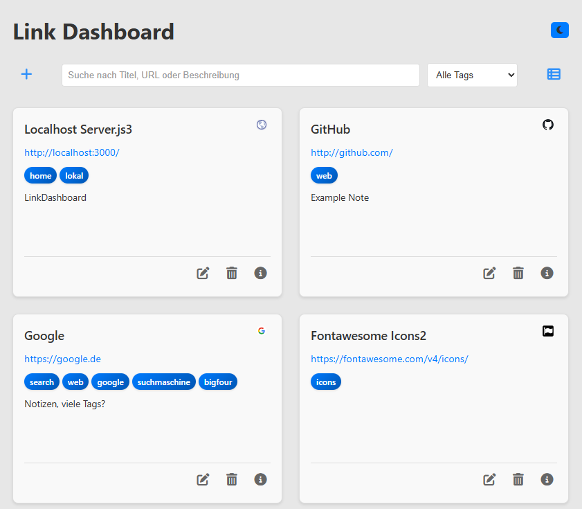

# Linkboard - Web-basiertes Link-Management-System

Ein modernes Dashboard zur Verwaltung und Organisation von Web-Links mit erweiterten Funktionen für Kategorisierung, Suche und Benutzerinteraktion.



## Architektur

### Backend
- **Runtime**: Node.js mit Express.js Framework
- **Datenbank**: SQLite mit automatischer Schema-Initialisierung
- **API**: RESTful Endpoints mit CORS-Unterstützung
- **Validierung**: Server-seitige Input-Validierung und Sanitization
- **Fehlerbehandlung**: Strukturierte Exception-Behandlung mit HTTP-Status-Codes

### Frontend
- **Technologie**: Vanilla JavaScript (ES6+)
- **Styling**: Modulares CSS mit CSS Custom Properties
- **Responsive Design**: Mobile-First Approach mit Flexbox/Grid
- **State Management**: LocalStorage für Benutzereinstellungen
- **API-Kommunikation**: Fetch API mit Promise-basierter Fehlerbehandlung

## Installation und Deployment

### Systemanforderungen
- Node.js >= 14.0.0
- npm >= 6.0.0

### Setup
```bash
# Repository klonen
git clone <repository-url>
cd linkboard

# Abhängigkeiten installieren
npm install

# Entwicklungsserver starten
npm start
```

Die Anwendung ist unter `http://localhost:3000` erreichbar.

### Produktions-Deployment
```bash
# Für Produktionsumgebung
NODE_ENV=production npm start
```

## Funktionsumfang

### Core Features
- **CRUD-Operationen**: Vollständige Link-Verwaltung (Create, Read, Update, Delete)
- **Tag-System**: Hierarchische Kategorisierung mit Autocomplete-Funktionalität
- **Suchfunktion**: Volltext-Indizierung über Titel, URL, Beschreibung und Tags
- **Filterung**: Tag-basierte Filterung mit Kombinationsmöglichkeiten
- **Dual-View**: Umschaltbare Darstellung zwischen Kachel- und Listenansicht
- **Theme-System**: Dark/Light Mode mit persistenter Speicherung
- **Metadaten**: Automatische Favicon-Extraktion und Notiz-Funktionalität

### Benutzerinteraktion
- **Modal-Dialoge**: Kontextuelle Formulare für Link-Bearbeitung
- **Bestätigungsdialoge**: Sicherheitsabfragen für destruktive Operationen
- **Keyboard-Navigation**: Vollständige Tastaturunterstützung (ESC, Enter)
- **Loading-States**: Asynchrone Operation-Feedback
- **Toast-Notifications**: Status-Benachrichtigungen für Benutzeraktionen

## API-Dokumentation

### Endpoints

#### GET /api/links
Ruft alle Links mit optionalen Query-Parametern ab.
```
Query Parameters:
- search: string (optional) - Volltext-Suche
- tag: string (optional) - Tag-Filter
```

#### POST /api/links
Erstellt einen neuen Link.
```json
{
  "title": "string (required)",
  "url": "string (required, valid URL)",
  "description": "string (optional)",
  "tags": "string (optional, comma-separated)",
  "notes": "string (optional)"
}
```

#### PUT /api/links/:id
Aktualisiert einen existierenden Link.

#### DELETE /api/links/:id
Löscht einen Link permanent.

#### GET /api/tags
Ruft alle verfügbaren Tags ab.

## Datenbankschema

### Links-Tabelle
```sql
CREATE TABLE links (
    id INTEGER PRIMARY KEY AUTOINCREMENT,
    title TEXT NOT NULL,
    url TEXT NOT NULL,
    description TEXT,
    tags TEXT,
    notes TEXT,
    created_at DATETIME DEFAULT CURRENT_TIMESTAMP,
    updated_at DATETIME DEFAULT CURRENT_TIMESTAMP
);
```

## Projektstruktur

```
linkboard/
├── server.js                 # Express-Server und API-Routen
├── package.json              # Projekt-Konfiguration und Abhängigkeiten
├── package-lock.json         # Dependency-Lock-File
├── index.html               # Single-Page-Application Entry Point
├── css/
│   ├── base.css             # CSS-Reset und Grundstyles
│   ├── layout.css           # Layout-System und Grid-Definitionen
│   ├── components.css       # UI-Komponenten-Styles
│   ├── dark-mode.css        # Dark-Theme-Variablen
│   └── light-mode.css       # Light-Theme-Variablen
├── js/
│   └── app.js              # Frontend-Anwendungslogik
├── notes/                   # Entwicklungsdokumentation
└── links.db                # SQLite-Datenbankdatei (auto-generiert)
```

## Konfiguration

### Umgebungsvariablen
- `PORT`: Server-Port (Standard: 3000)
- `NODE_ENV`: Umgebung (development/production)
- `DB_PATH`: Pfad zur SQLite-Datenbankdatei

### CSS Custom Properties
Das Theme-System nutzt CSS Custom Properties für konsistente Farbgebung:
```css
:root {
  --primary-color: #007bff;
  --background-color: #ffffff;
  --text-color: #333333;
  /* ... weitere Variablen */
}
```

## Performance-Optimierungen

- **Lazy Loading**: Asynchrones Laden von Link-Metadaten
- **Debounced Search**: Verzögerte Suchausführung zur Reduzierung von API-Calls
- **Efficient DOM Updates**: Minimale DOM-Manipulationen durch Virtual-DOM-ähnliche Patterns
- **CSS-Optimierung**: Modulare Stylesheets mit minimaler Redundanz

## Sicherheitsaspekte

- **Input-Sanitization**: Server-seitige Bereinigung aller Benutzereingaben
- **SQL-Injection-Schutz**: Prepared Statements für Datenbankoperationen
- **XSS-Prävention**: Escape von HTML-Inhalten in der Ausgabe
- **CORS-Konfiguration**: Kontrollierte Cross-Origin-Requests

## Browser-Kompatibilität

- Chrome/Chromium >= 60
- Firefox >= 55
- Safari >= 12
- Edge >= 79

## Entwicklung

### Code-Standards
- ES6+ JavaScript mit strikter Typisierung
- Modulares CSS mit BEM-ähnlicher Namenskonvention
- RESTful API-Design-Prinzipien
- Semantisches HTML5

### Testing
```bash
# Unit-Tests ausführen (falls implementiert)
npm test

# Linting
npm run lint
```

## Roadmap

### Geplante Features
- Import/Export-Funktionalität (JSON, CSV)
- Benutzer-Authentifizierung und -Autorisierung
- Link-Kategorien zusätzlich zu Tags
- Bulk-Operationen für mehrere Links
- Link-Vorschau mit Thumbnail-Generierung
- API-Rate-Limiting
- Volltext-Suchindex-Optimierung

### Technische Verbesserungen
- TypeScript-Migration
- Unit-Test-Suite
- Docker-Containerisierung
- CI/CD-Pipeline
- Performance-Monitoring

## Lizenz

[Lizenzinformationen hier einfügen]

## Beitragen

Contributions sind willkommen. Bitte beachten Sie die Coding-Standards und erstellen Sie Pull-Requests gegen den `develop`-Branch.
